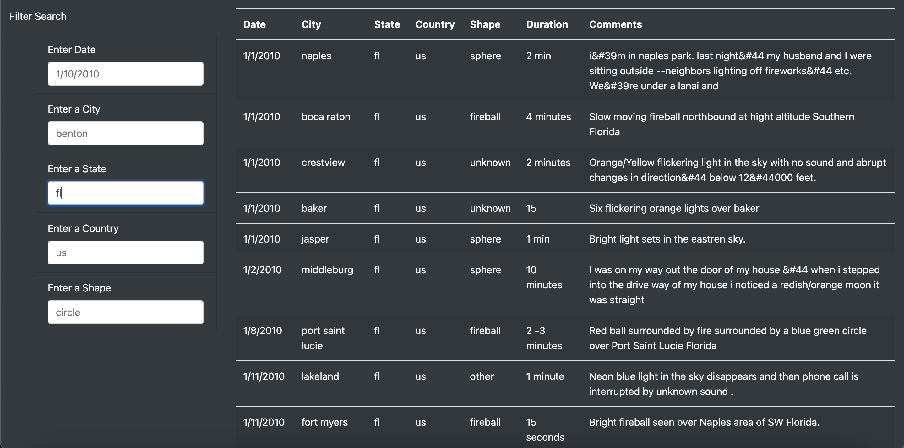

# UFOs

## Overview of Project 
  Dana would like to provide a more in-depth analysis of UFO sightings by allowing users to filter for multiple criteria at the same time on her webpage.     Her previous webpage only filtered using dates. In addition to the date, she wanted to add table filters for the city, state, country, and shape. 

## Results
  In adding multiple filters on the webpage, users are now allowed to filter table data by city, state, country, shape and date. 
  In order to do this, there are 5 input fields on the UFO sightings page. All the user has to do is enter one of the five filters. As shown below:
  
  
  
  Fl was added to the state filter, and you can see all the results in the table are FL UFO sightings.
  You can also add another filter, and shown below, we added in sphere as well, and this filtered the sphere shaped UFO's in FL.
  
  
  
  
## Summary 
  In summary, this has been a very helpful addition to Dana's webpage. However, there is one drawback to this new design. We don't know which cities are logged in the data table, if you are just visiting the website. You would have to inspect the data.js file in order to know what cities/shapes/states etc are logged in. So if you are first time user to the site, you would have to randomly keep typing in cities and hope that there is data in that city, or for that shape etc. One way to make this better would be to have drop down menus for each filter. This way, you could choose from the options that are available in the data set. Another way to enhance this webpage would be to add images to the table as well. It would be very cool to add images, especially for the shapes category of the table, that way it adds a more visual component to the webpage.
